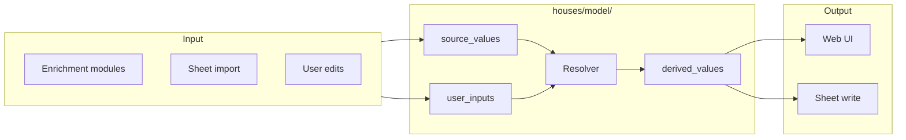

# Coding Standards — Houses

Project-specific rules that supplement the shared coding standards.
Read both. If they conflict, this file takes precedence.

## Design Principles

### Separation of Concerns

Every module, class, and function should have one reason to change.
Code that deals with different concerns (HTTP vs business logic vs
persistence) must live in different modules with a one-way dependency
chain (see the layer diagram in the DAG section below).

When you feel the urge to import from a sibling layer or mix I/O with
computation, that's a signal to split — not a shortcut to take.

### Cohesive Classes: Data and Behaviour Together

Group data with the methods that operate on it. A class should own its
invariants — don't let external code reach into a dataclass to compute
derived values that the class could compute itself.

A class full of public fields that every other module reads and manipulates
is not a class, it's a poorly-organised dict. If the behaviour lives
outside the data, the data should be a primitive and the behaviour should
live in a function — but if you find yourself writing ``get_*`` accessors
that feed into procedural code, that's a missed abstraction.

### Names Communicate Intent

A name's job is to tell the reader what something means and why it exists.
Choose names that relate to the domain (``monthly_mortgage_payment``, not
``calculate_value_3``). A name that needs a comment to explain is a failed
name.

- **Classes** are nouns in the domain language (``StampDutyNode``,
  ``CommuteSelector``).
- **Functions/methods** are verbs or verb phrases (``resolve_property``,
  ``compute``, ``insert_source_value``).
- **Variables** say what they hold, not how they're stored (``price``, not
  ``x``; ``cost_by_operator``, not ``dict2``).
- **Booleans** read naturally in an ``if``: ``has_school``, not
  ``school_flag``.

### Anti-Fragile Code: Correct by Construction

Write code that is self-explanatory and self-evidently correct — code
whose correctness you can verify by reading it, not by tracing every
possible execution path.

**Practices that produce anti-fragile code:**

- Use types that make invalid states unrepresentable (see "Semantic Types
  Over Primitives" below). If you can't construct a wrong value, you
  can't ship a wrong value.
- Prefer pure functions over stateful methods. A function that only
  reads its arguments and returns a value is trivially correct and
  trivially testable.
- Make invalid control flows impossible. A function that returns ``None``
  forces every caller to remember to check. A function that returns a
  discriminated union (``Attempt``, ``Result``) makes the error path
  explicit in the type system.
- Use the type system as safety net. Don't cast or suppress warnings —
  if the type checker flags something, fix the types.
- Design APIs so the happy path reads naturally and the error paths are
  explicit (not buried in exceptions or None checks).

**Signs of coincidentally-correct code:**

- "It works in my test because I control the environment, but I'm not sure
  why."
- Removing or reordering lines "happens to work" but you're not sure if
  there's a latent bug.
- A change in one module breaks something unrelated and far away.
- The codebase has unwritten rules that every developer must remember
  ("always call X before Y").

Anti-fragile code replaces unwritten rules with compiler-enforced ones.
It doesn't depend on luck, ordering, or the current state of the world.

## Module Structure

```
houses/
├── server.py              # FastAPI app, endpoints, enrichment orchestration
├── enrichment_runner.py   # Enrichment coordination (commute, schools, etc.)
├── dag/                   # DAG library (DerivedNode, UserInputNode, Attempt, signals)
├── nodes/                 # DAG node definitions
├── web/                   # Presentation
│   ├── api_router.py      # API route handlers
│   ├── card_data.py       # Card view model assembly
│   └── broadcaster.py     # WebSocket push
├── sheets/                # Google Sheets I/O (package: Tab, Row, View, formulas)
├── services.py            # DI protocols + Services container (ports + adapters)
├── context.py             # ContextVar per-request state
├── config.py              # pydantic-settings configuration
├── location.py            # Geocoding (postcodes.io, ORS, Google, Nominatim)
├── transit_route.py       # TfL API + park-and-ride
├── commute.py             # Commute value objects
├── bus_journey.py         # Bus fare zone data
├── walkability.py         # Google Maps Places + ORS walking
├── council_tax.py         # VOA scraper
├── epc.py                 # EPC lookup
├── town_desc.py           # LLM town descriptions
├── schools.py             # School lookup (GIAS CSV)
├── stations.py            # Station class + registry
├── routing.py             # Transit/drive routing dispatch
├── retry.py               # Async retry with backoff
└── templates/             # Jinja2 HTML templates
    ├── base.html
    ├── property_list.html
    ├── property_detail.html
    ├── _card.html
    └── ...
```

Each module should have one reason to change.

## Value Types

### Semantic Types Over Primitives

Every value's type must encode its semantics, not just its raw shape.
A bare ``str``, ``int``, ``float``, or ``dict`` tells you nothing about
what the value means — every function must re-discover or guess the
encoding, and mismatches are silent.

Instead, use a specific type that makes the semantics obvious and the
encoding correct by construction:

| Primitive | Semantic type | Why |
|-----------|-------------|-----|
| ``str`` for a point in time | ``datetime.datetime`` | Timezone-aware arithmetic, no parsing errors |
| ``float`` for a price | ``money.Money`` | Currency is part of the value, no silent £/$ mix-ups |
| ``int`` for a duration | ``pint.Quantity`` | Unit is part of the value, metres ≠ kilometres |
| ``dict`` for structured data | A ``dataclass`` or ``TypedDict`` | Field names, types, and required/optional are explicit |
| ``str`` for an enumerated value | An ``enum`` | Valid values are known at compile time |

This rule is not about ceremony — it's about eliminating entire classes
of bugs at the type-checking step. Every time you reach for a ``dict``,
list, or primitive, ask: "Is there a type that makes this impossible to
misuse?"

### Monetary Values: `money.Money`

All monetary values must use the ``money.Money`` type (from the ``money``
package). Never use a bare ``float`` or ``int`` for prices, costs, or
any currency amount.

``Money`` encapsulates both the numeric value and the currency, so field
names do not repeat the currency (``price``, not ``price_gbp``).

```python
from money import Money

# Correct
price: Money = Money(650_000, "GBP")
daily_cost: Money = Money(100.0, "GBP")

# Wrong
daily_cost: float = 100.0  # what currency?
```

### Durations and Distances: `pint.Quantity`

Durations and distances must use ``pint.Quantity`` with an appropriate
unit. Never use a bare ``int`` or ``float`` for minutes, kilometres, or
any measured quantity.

This keeps unit conversions explicit and prevents silent unit mismatches
(e.g. confusing metres and kilometres).

```python
from pint import Quantity as _Quantity

# Correct
duration: _Quantity = 32 * ureg.minutes
distance: _Quantity = 1.5 * ureg.kilometres

# Wrong
duration: int = 32  # minutes? seconds?
```

### Each Class in Its Own Module

Each class should be in its own module, named after that class. The
exception is a module that groups closely related small dataclasses —
for example, `models.py` bundling several small models is fine because
each is just a handful of fields with no behaviour and they share the
same reason to change (the data schema). If a class grows non-trivial
behaviour, extract it to its own module.

## DAG Model Is the Source of Truth

**The DAG (`houses/model/`) is the single authoritative store for all
resolved property data.** Every piece of information about a property --
address, location, bedrooms, price, commute times, school ratings, council
tax, EPC band, walkability -- goes through the DAG.

The DAG is not just an address/location resolver. It is the universal
data model:



### What Belongs in the DAG

Every enrichment module that produces a value for a property must store
that value as a source_value node in the DAG. This includes:

- **Rightmove scrape**: address, bedrooms, price, map coordinates
- **Commute**: Simon transit time, Lorena transit time, Bracknell drive time
- **Schools**: primary and secondary school names, Ofsted ratings, walk times
- **Council tax**: band, cost
- **EPC**: rating, potential rating
- **Walkability**: walk-to-town time, amenities
- **Geocoding**: lat/lng from any source

Every display or sheet-write operation reads from the DAG's derived
values. No module re-implements a priority chain or combines raw inputs
-- the DAG resolver does that once.

### Dependency Direction

```
Presentation (routes, templates)
  → Application (enrichment_runner, card_data, import)
    → Domain Model (DAG nodes, resolver)
      → Infrastructure (persistence, sheets, external APIs)
```

Each layer only depends on the layer below it. The DAG (Domain Model)
has no knowledge of HTTP, sheets, or API clients. The Application layer
orchestrates: it calls enrichment modules (which write source_values),
then the DAG resolver (which computes derived values), then output
modules (which read derived values for display or sheet write).

### What Does NOT Go in the DAG

- **Sheet import logic**: imports call `insert_source_value()` and
  `resolve_property()` but do not re-implement priority chains or
  validation. The DAG's node definitions are the single source of truth
  for those rules.
- **Card/display assembly**: reads the DAG's resolved values via
  `load_property_data()` or `resolve_property()`. It never decides
  which value is "best" -- the DAG already decided.
- **Enrichment runners**: write source values into the DAG via
  `insert_source_value()`, then call `resolve_property()` to trigger
  derived computation. They do not make priority decisions.

### Design for New Nodes

When adding any new property data:

1. **Declare source nodes** in `nodes.py` for each raw input (e.g.
   `rightmove_bedrooms`, `tfl_simon_duration`).
2. **Declare derived nodes** for resolved values that combine or elevate
   inputs (e.g. `best_commute_time`).
3. **Enrichment module** writes to source_values via
   `insert_source_value()`.
4. **Templates and sheet writes** read from derived_values via
   `load_property_data()` or `resolve_property()`.

The DAG handles staleness, re-computation, and priority. No other code
needs to know the resolution logic.

### Rule of Thumb

If two places in the codebase need the same business rule (e.g. "user
correction overrides Rightmove data"), that rule belongs in a DAG node
definition — NOT in both the import function and the card builder. The
DAG resolves once; everything else reads the result.

## Houses-Specific Practices

### Never Trash the Sheet

- Never clear and regenerate the whole sheet. Manual data (listing
  addresses, notes, status) is irreplaceable.
- A full clear + rewrite (`ws.clear()` followed by backfill) is
  forbidden. It destroys manual data and breaks View tab formulas.
- Use `POST /properties?fields=...&force=true` to update specific
  columns that need refreshing.

### Column Migrations

- Use `scripts/sheet_tool.py` for column operations: `add`, `move`, `rename`,
  `delete`. This is the only tool for grid manipulation. Do not call
  `insert_cols`, `deleteDimension`, `add_cols`, or `clear` directly.
- After a column change, call `POST /sync-view-formulas` to refresh View tab
  formulas and named ranges to match the new column positions.
- Delete one-off migration scripts after they've been run. The git log
  preserves the history.
- Update `Row.HEADERS` and `Row.from_property()` in `houses/sheets/row.py` to match the
  new column layout. Run a batch refresh to populate the new column.

### User Columns Are Never Overwritten

- User-provided columns (Rightmove URL, Address, Postcode, Bedrooms,
  Price, Actual Latitude, Actual Longitude, Actual Postcode) must never
  be written by the server. `Row.from_property()` returns `""` for all of them.
- The Rightmove ID column is the server's stable lookup key.
- `write_enriched_row` uses the Rightmove ID column to find existing rows.
  It only writes non-empty cells to avoid blanking user data.

### API Keys and Secrets

- Keys come from the environment only. The `.env` file is for non-secret
  configuration.
- **Never read, log, print, echo, or store API keys** in conversation
  context, files, code, or any output. Never include them in cache keys.
  Never pass them in URLs or request bodies — use headers only.
- If a secret appears in an error message, redact it before logging.

### Fail Fast, Don't Pre-Check

- Don't check for failure before trying an operation — just let the code
  fail naturally. The shared coding standards call this principle explicitly:
  "Don't silence errors with fallbacks BUT don't check for failure before
  trying, just let the code fail."
- A function should not pre-validate API keys before making the call.
  The HTTP transport mock handles requests in tests regardless of the key
  value. In production, a missing key causes a 403 which propagates as a
  regular API error.

### Cache Key Hygiene

- Never include API keys in cache key parameters. Credential rotation
  should not invalidate the cache.
- Do not cache non-OK API responses (e.g., `REQUEST_DENIED`). A temporary
  key issue should not poison the cache permanently.

### Force Parameter Discipline

- `force=true` overwrites existing cells. Use only when you know the new
  data is better than what is in the sheet.
- `force=false` (default) only fills blank cells. This is the safe default
  for incremental enrichment.
- The `force` parameter must reach BOTH `_batch_stream()` and
  `_write_backfill_cells()`. If the call chain drops it, every cell is
  treated as "already has data" regardless of the query parameter.

### Querying Properties

- `GET /properties` and `GET /properties/{rid}` require a `?tab=view` or
  `?tab=data` parameter. Without it, the endpoint returns an error.
- The View tab has XLOOKUP formulas that reference the Data tab. After
  writing data, call `POST /sync-view-formulas` if needed.

## Dependency Injection

The shared coding standards describe three DI patterns: local `_kwarg`
injection, `Services` composition root, and context vars. This project
uses all three — see how each is applied here:

| Pattern | Houses implementation | When to use |
|---------|----------------------|-------------|
| **`Services` container** | `houses/services.py` — `Services` dataclass with every enrichment service and real defaults. `_run_enrichment` accepts optional `services` param. | Replace an entire enrichment module (EPC, council tax, commute) |
| **Context vars** | `houses/context.py` — `get_services()`, `get_bus_fare_reader()`, `get_sheets_client()`. Server middleware initialises per-request state. | Per-request singletons (bus fares, sheets client, geo state) |
| **Local `_kwarg`** | `_registry` on `_add_parking_cost`, `_page_path` on `scrape()`, etc. | Leaf-level data objects (car park data, HTML fixtures) |

Reusable fakes live in `tests/helpers.py`. Use `make_services()` to build a
`Services` with all fakes at sensible defaults, or construct a custom
`Fake*` for individual service overrides.

## Testing

### Three Mocking Layers

Tests run at three boundaries, from simplest to most thorough:

**1. Pure functions** — no mocking at all. Test real logic with real inputs
and assert output values. (Most of ``tests/unit/`` works this way.)

**2. Function-parameter injection** — pass a fake service or data object
via the ``_kwarg`` pattern. No monkeypatch, no MockTransport.

```python
result = await route._add_parking_cost(data, 30.0, _registry=registry)
```

**3. ``Services`` container** — build a ``Services`` with fakes and pass
to ``_run_enrichment``.

```python
from tests.helpers import make_services

services = make_services(
    epc_service=FakeEPC(band="C"),
    commute_router=FakeCommuteRouter(simon=None),
)
result = await _run_enrichment(..., services=services)
```

**4. ``ContextVar``** — set per-request state for the test scope.

```python
import houses.context as ctx

token = ctx._request_bus_fares.set(my_registry)
try:
    result = await get_commute(...)
finally:
    ctx._request_bus_fares.reset(token)
```

**5. MockTransport** (legacy) — the integration conftest patches httpx at
the transport layer.  Works for tests that need fine-grained HTTP response
control. Defined in ``tests/integration/conftest.py``.

### Reusable Fakes

``tests/helpers.py`` provides ready-made fakes for every service:

| Fake | Overrides |
|------|-----------|
| ``FakeGeocoder`` | ``result``, ``postcode_override`` |
| ``FakeCommuteRouter`` | ``simon``, ``lorena``, ``petrol`` |
| ``FakeEPC`` | ``band`` |
| ``FakeCouncilTax`` | ``band``, ``cost`` |
| ``FakeWalkability`` | ``walk_to_town_minutes``, ``amenities`` |
| ``FakeTownDesc`` | ``description`` |
| ``FakeSchoolLookup`` | returns ``None`` for all lookups |
| ``FakeRailFare`` | passes simon/lorena through unchanged |

Use ``make_services()`` for a ``Services`` with all fakes at sensible
defaults:

```python
services = make_services(epc_service=FakeEPC(band="B"))
```

### Test Organization

- **Unit tests** (`tests/unit/`): Test one function or module in isolation.
  No real API calls. Prefer ``_kwarg`` injection or pure-function tests.
- **Integration tests** (`tests/integration/`): Test the full pipeline.
  Can use ``Services`` fakes, ``ContextVar``, or MockTransport.
- **E2E tests** (marked ``@pytest.mark.e2e``): Verify real external APIs.
  **One consolidated suite per external API.** Skipped by default.

### MockTransport (Legacy — For Migration Only)

The integration conftest patches ``httpx.AsyncClient`` and ``httpx.Client``
with a ``MockTransport``. New tests should prefer ``Services`` or
``ContextVar`` DI instead. When converting a MockTransport test to DI:

1. Identify which enrichment services the test exercises.
2. Create fakes via ``tests/helpers.py``.
3. Pass ``services=make_services(...)`` to ``_run_enrichment``.
4. Remove the test from ``_mock_http_requests`` dependency.

### Detailed Test Standards

See ``docs/testing-standards.md`` for the full reference: test file naming,
determinism requirements, test isolation, and patterns for every scenario.

## Documentation

- **Delete, don't archive.** Obsolete content is a liability. When something
  is no longer accurate, delete it. Don't move it to an archive, don't leave
  a deprecation notice. If it's wrong, remove it.
- **Single source of truth**: Each piece of information lives in exactly one
  place. Other docs link to it. They don't repeat it. If you find duplicated
  content, pick one home and link from the other locations.
- **Docs must match the code**: When you rename a function, module, or tab,
  update the docs in the same commit.
