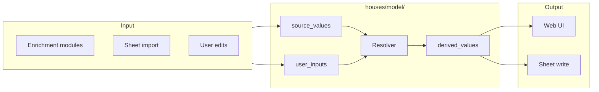

# Coding Standards — Houses

Project-specific rules supplementing the shared coding standards. Read both. If they conflict, this file takes precedence.

## Design Principles

| Principle | Rule |
|---|---|
| **Separation of concerns** | One reason to change per module/class/function. HTTP vs business vs persistence live in different modules with one-way dependency chains. Urge to import from a sibling layer or mix I/O with computation = split, not shortcut. |
| **Cohesive classes** | Data + behaviour together. A class owns its invariants; external code never reaches into a dataclass to compute derived values. Public-field classes that others manipulate = poorly-organised dict. `get_*` accessors feeding procedural code = missed abstraction. |
| **Names communicate intent** | Domain names, not shapes: `monthly_mortgage_payment` not `calculate_value_3`. A name needing a comment = failed name. Classes = domain nouns (`StampDutyNode`); functions = verbs (`resolve_property`); variables = what they hold (`price` not `x`); booleans read in `if` (`has_school` not `school_flag`). |
| **Anti-fragile: correct by construction** | Types make invalid states unrepresentable; pure functions preferred; error paths explicit in the type system (discriminated unions, not `None`); never cast/suppress type-checker flags; happy path reads naturally. Signs of coincidental correctness: works only in your test env, reordering "happens to work", unrelated breakage, unwritten rules ("always call X before Y"). |

## Module Structure

```
houses/
├── server.py              # FastAPI app, endpoints, enrichment orchestration
├── enrichment_runner.py   # Enrichment coordination (commute, schools, etc.)
├── dag/                   # DAG library (DerivedNode, UserInputNode, Attempt, signals)
├── nodes/                 # DAG node definitions
├── web/                   # Presentation
│   ├── api_router.py      # API route handlers
│   ├── card_data.py       # Card view model assembly
│   └── broadcaster.py     # WebSocket push
├── sheets/                # Google Sheets I/O (package: Tab, Row, View, formulas)
├── services.py            # DI protocols + Services container (ports + adapters)
├── context.py             # ContextVar per-request state
├── config.py              # pydantic-settings configuration
├── location.py            # Geocoding (postcodes.io, ORS, Google, Nominatim)
├── transit_route.py       # TfL API + park-and-ride
├── commute.py             # Commute value objects
├── bus_journey.py         # Bus fare zone data
├── walkability.py         # Google Maps Places + ORS walking
├── council_tax.py         # VOA scraper
├── epc.py                 # EPC lookup
├── town_desc.py           # LLM town descriptions
├── schools.py             # School lookup (GIAS CSV)
├── stations.py            # Station class + registry
├── routing.py             # Transit/drive routing dispatch
├── retry.py               # Async retry with backoff
└── templates/             # Jinja2 HTML templates
```

Each module has one reason to change.

## Value Types

### Semantic types over primitives

| Primitive | Semantic type | Why |
|-----------|-------------|-----|
| `str` for a point in time | `datetime.datetime` | Timezone-aware arithmetic, no parsing errors |
| `float` for a price | `money.Money` | Currency part of the value; no silent £/$ mix-ups |
| `int` for a duration | `pint.Quantity` | Unit part of the value; metres ≠ kilometres |
| `dict` for structured data | `dataclass`/`TypedDict` | Field names, types, required/optional explicit |
| `str` for enumerated value | `enum` | Valid values known at compile time |

Before reaching for a `dict`/list/primitive: "Is there a type that makes this impossible to misuse?"

### Money

All monetary values use `money.Money`. Never bare `float`/`int` for prices, costs, currency amounts. `Money` encapsulates value + currency, so field names don't repeat currency (`price`, not `price_gbp`):

```python
# ✓
price: Money = Money(650_000, "GBP")
daily_cost: Money = Money(100.0, "GBP")
# ✗ what currency?
daily_cost: float = 100.0
```

### Durations & distances

Use `pint.Quantity` with a unit. Never bare `int`/`float` for minutes, kilometres, measured quantities:

```python
# ✓
duration: _Quantity = 32 * ureg.minutes
distance: _Quantity = 1.5 * ureg.kilometres
# ✗ minutes? seconds?
duration: int = 32
```

### Each class in its own module

Named after the class. Exception: a module grouping closely related small dataclasses (e.g. `models.py` with several handful-of-fields, no-behaviour models sharing one reason to change). Extract once a class grows non-trivial behaviour.

## DAG Model Is the Source of Truth

**`houses/model/` (and `houses/nodes/`) is the single authoritative store for all resolved property data.** Address, location, bedrooms, price, commutes, schools, council tax, EPC, walkability — all go through the DAG.



### What belongs in the DAG

Every enrichment module producing a property value stores it as a source_value node: Rightmove scrape (address, bedrooms, price, coords), commute (Simon transit, Lorena transit, Bracknell drive), schools (names, Ofsted, walk times), council tax (band, cost), EPC (rating, potential), walkability (walk-to-town, amenities), geocoding (lat/lng).

Every display/sheet-write reads derived values. **No module re-implements a priority chain or combines raw inputs — the DAG resolver does that once.**

### Dependency direction

```
Presentation (routes, templates)
  → Application (enrichment_runner, card_data, import)
    → Domain Model (DAG nodes, resolver)
      → Infrastructure (persistence, sheets, external APIs)
```

Each layer depends only on the layer below. The DAG knows no HTTP/sheets/API clients. Application orchestrates: enrichment (writes source_values) → resolver (computes derived) → output (reads derived for display/sheet).

### What does NOT go in the DAG

| Code | Does | Never does |
|---|---|---|
| Sheet import | calls `insert_source_value()`, `resolve_property()` | re-implements priority/validation |
| Card/display | reads resolved values via `load_property_data()`/`resolve_property()` | decides which value is "best" |
| Enrichment runners | write source values, call `resolve_property()` | make priority decisions |

### Design for new nodes

1. Declare **source nodes** in `nodes.py` for each raw input (`rightmove_bedrooms`, `tfl_simon_duration`).
2. Declare **derived nodes** for resolved values (`best_commute_time`).
3. **Enrichment module** writes to source_values via `insert_source_value()`.
4. **Templates/sheet writes** read derived_values via `load_property_data()`/`resolve_property()`.

Staleness, re-computation, priority are the DAG's job. No other code knows the resolution logic.

### Rule of thumb

A business rule needed in two places (e.g. "user correction overrides Rightmove") belongs in a DAG node definition — not in both the import function and the card builder. Resolve once; everything else reads.

## Houses-Specific Practices

### Datetimes: UTC, aware, explicit boundaries

1. **Store/process UTC.** Never `datetime.now()` — always `datetime.now(UTC)`.
2. **Display local** at the presentation boundary (template, API response). Model never stores local times.
3. **External sources**: document the source's timezone, convert explicitly to UTC before storing.
4. **From DB**: `fromisoformat` may return naive. After parsing, check `dt.tzinfo is None` → `dt.replace(tzinfo=UTC)`.

Naive datetimes are a systemic bug source: aware↔naive comparisons raise `TypeError`; arithmetic is wrong across DST. UTC storage removes ambiguity; boundary conversion keeps the model simple.

```python
# ✓
now = datetime.now(UTC)
# ✗ raises TypeError vs UTC datetimes
now = datetime.now()
# ✓ parse then ensure aware
raw = db_row["created_at"]
dt = datetime.fromisoformat(raw)
if dt.tzinfo is None:
    dt = dt.replace(tzinfo=UTC)
# ✗ may produce offset-naive datetime
self._persisted_at = datetime.fromisoformat(raw)
```

### Sheet rules

**Never clear/regenerate the whole sheet.** Manual data (addresses, notes, status) is irreplaceable. `ws.clear()` + backfill is forbidden — destroys manual data, breaks View tab formulas. Use `POST /properties?fields=...&force=true` for specific columns.

**Column migrations** — `scripts/sheet_tool.py` only (`add`, `move`, `rename`, `delete`). Never call `insert_cols`/`deleteDimension`/`add_cols`/`clear` directly. After a change: `POST /sync-view-formulas`; update `Row.HEADERS` + `Row.from_property()` in `houses/sheets/row.py`; batch refresh to populate. Delete one-off migration scripts after running (git log preserves history).

**User columns never overwritten** — Rightmove URL, Address, Postcode, Bedrooms, Price, Actual Lat/Long/Postcode: server never writes them. `Row.from_property()` returns `""` for all. Rightmove ID column is the server's stable lookup key; `write_enriched_row` uses it to find rows and writes only non-empty cells.

### API keys & secrets

Environment only. `.env` is for non-secret config. **Never read, log, print, echo, or store keys** in context, files, code, output, cache keys, URLs, or request bodies — headers only. Redact keys from error messages before logging.

### Fail fast, don't pre-check

Don't pre-validate before trying — let code fail naturally. Don't pre-check API keys before the call: missing key → 403 propagates as a normal API error; the HTTP transport mock handles requests regardless of key value.

### No backward compatibility shims

**Delete dead code, don't deprecate it.** A shim compiles, passes tests, lulls readers into thinking it's real, and never gets cleaned up. Rename/remove + update every caller in the same commit. No aliases, no re-exports, no "will remove in a future version".

### Never swallow errors

Every `except` block must log, re-raise, or handle observably. Bare `except: pass` / silent `except Exception:` forbidden. Safe-to-ignore errors log at `DEBUG` with an explanation.

```python
# ✗ invisible
try:
    do_something()
except Exception:
    pass
# ✓ observable
try:
    do_something()
except Exception as e:
    logger.debug("do_something failed (non-fatal): %s", e)
```

DAG-specific error rules (`AttemptError` contract, API services return Attempt vs pure code throw, transient re-raise/retry, nodes propagate never re-literalize) → [dag-library.md](dag-library.md) *The three-state result: `Attempt[T]`*.

### Cache key hygiene

- Never include API keys in cache key parameters (rotation shouldn't invalidate the cache).
- Never cache non-OK API responses (`REQUEST_DENIED`) — a temporary key issue must not poison the cache.

### Force parameter discipline

- `force=true`: overwrite existing cells. Only when new data is known better.
- `force=false` (default): fill blank cells only. Safe default for incremental enrichment.
- `force` must reach BOTH `_batch_stream()` and `_write_backfill_cells()`. If the call chain drops it, every cell is treated as "already has data".

### Querying properties

`GET /properties` and `GET /properties/{rid}` REQUIRE `?tab=view` or `?tab=data` — otherwise an error. After writing data, call `POST /sync-view-formulas` if needed (View tab XLOOKUPs reference Data tab).

## Dependency Injection

| Pattern | Houses implementation | When |
|---------|----------------------|------|
| **`Services` container** | `houses/services.py` — `Services` dataclass, every enrichment service with real defaults; `_run_enrichment` accepts optional `services` param | Replace an entire enrichment module (EPC, council tax, commute) |
| **Context vars** | `houses/context.py` — `get_services()`, `get_bus_fare_reader()`, `get_sheets_client()`; middleware initialises per-request state | Per-request singletons (bus fares, sheets client, geo state) |
| **Local `_kwarg`** | `_registry` on `_add_parking_cost`, `_page_path` on `scrape()`, etc. | Leaf-level data objects (car park data, HTML fixtures) |

Reusable fakes in `tests/helpers.py`. `make_services()` = all fakes at sensible defaults; construct a custom `Fake*` for individual overrides.

## Testing

### Three mocking layers (plus two legacy/extra)

| Layer | Technique | Notes |
|---|---|---|
| 1. Pure functions | no mocking | real inputs → assert outputs (most of `tests/unit/`) |
| 2. Function-param injection | `_kwarg` fake | no monkeypatch, no MockTransport |
| 3. `Services` container | fakes → `_run_enrichment` | `make_services(epc_service=FakeEPC(band="C"))` |
| 4. `ContextVar` | set per-request state for test scope | `ctx._request_bus_fares.set(...)` in try/finally |
| 5. MockTransport (legacy) | patches httpx transport | fine-grained HTTP control; `tests/integration/conftest.py` — migrate to DI |

### Reusable fakes

| Fake | Overrides |
|------|-----------|
| `FakeGeocoder` | `result`, `postcode_override` |
| `FakeCommuteRouter` | `simon`, `lorena`, `petrol` |
| `FakeEPC` | `band` |
| `FakeCouncilTax` | `band`, `cost` |
| `FakeWalkability` | `walk_to_town_minutes`, `amenities` |
| `FakeTownDesc` | `description` |
| `FakeSchoolLookup` | returns `None` for all lookups |
| `FakeRailFare` | passes simon/lorena through unchanged |

Every fake declares its service protocol as base class (`class FakeEPC(EPCLookupService)`); `make_services` override kwargs are typed against the protocols. A protocol signature change (e.g. `lookup` returning `Attempt[str]` instead of `str`) is flagged by basedpyright/mypy at edit time — drift never reaches runtime.

### Test organization

- **Unit** (`tests/unit/`): one function/module in isolation, no API calls; `_kwarg` injection or pure functions.
- **Integration** (`tests/integration/`): full pipeline; `Services` fakes, `ContextVar`, or MockTransport.
- **E2E** (`@pytest.mark.e2e`): real external APIs; one consolidated suite per API; skipped by default.

### MockTransport (legacy — migration only)

When converting to DI: identify exercised enrichment services → create fakes via `tests/helpers.py` → pass `services=make_services(...)` to `_run_enrichment` → drop the test from `_mock_http_requests`.

### Detailed test standards

See `docs/testing-standards.md` — naming, determinism, isolation, per-scenario patterns.

## Documentation

- **Delete, don't archive.** Obsolete content is a liability. Wrong = remove; no archive dirs, no deprecation notices.
- **Single source of truth**: each fact in exactly one place; other docs link, never repeat. Duplicated content → pick one home, link the rest.
- **Docs must match code**: rename a function/module/tab → update docs in the same commit.
